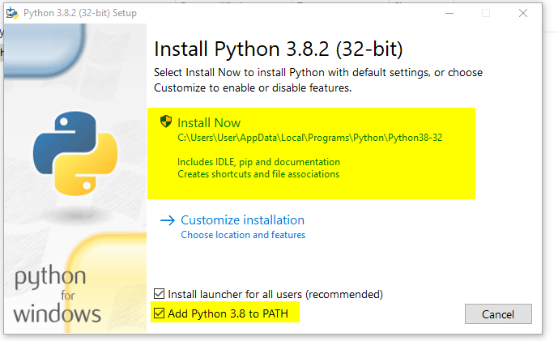
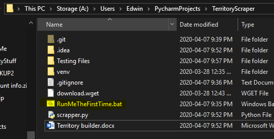
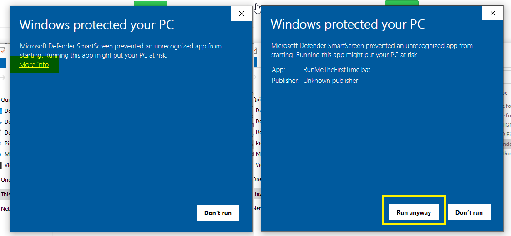

Phone territory builder V0.1
First run instructions

1.	Download Python from here and install it

	https://www.python.org/downloads/

2.	Check the box for "Add Python 3.8 to PATH" and then select install now.
	

3.	Select close when it finishes installing.
	

4.	Download the program repository
	

5.	Open the folder and drag the folder TerritoryScraper-master to a desired directory and open the extracted folder.

6.	Once your there click on the file called RunMeTheFirstTime.bat
	 

7.	If you get a windows protected your pc alert just click more info and then Run anyways. It might take a few minutes to install so dont close the window. It will close itself once it has finsihed.
	

8.	Move the territory you want to get the phone numbers for into the folder TerritoryScraper-Master

9.	Click on Scrapper.py

10.	Select the territory type
	1. If you are using something like territory helper type "1" (without the qoutes) and hit enter. As of 4/11 this is still under development.
	2. Use this if you have a territory in .xls, .xlsx format (it will open using excel). Type "2" (without the qoutes) and then hit enter.
	3. Use this if you just want to lookup all of the phone numbers on a specific street. Type "3" (without the qoutes) and then hit enter.

11.	If you are using option 2 it will output a file in the same folder with the same name as the territory. It has the name, address and phone number of the numbers that it finds online. Please compare the numbers to your original territory to make sure there are no extra numbers on the outputed copy.

Every other run instruction

1.	Go to the folder TerritoryScraper-master
	
2.	Follow instructions from step 9 onwards in the previous section.
 
