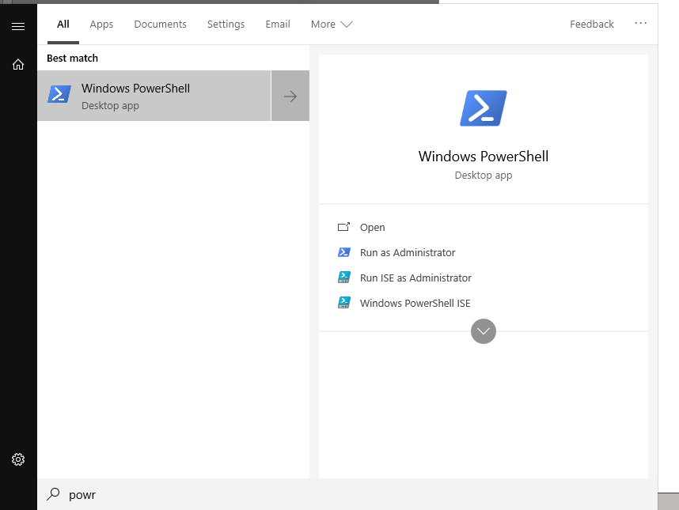
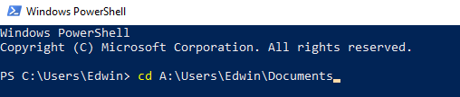
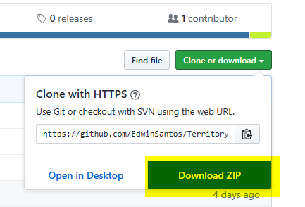
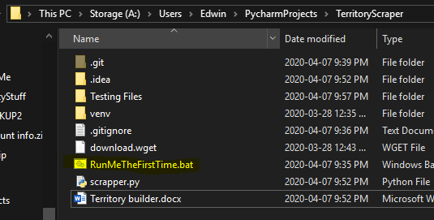

Phone territory builder V0.1
First run instructions

1.	Download Python from here and install it with the default options

	https://www.python.org/ftp/python/3.8.2/python-3.8.2.exe

2.	Open powershell 

 
3.	Type “cd” and the path of the directory where you want to manage your territories from. The sake of simplicity use Documents. If you want to use windows enter: 

     cd C:\Users\ [YOUR COMPUTERS NAME HERE] \Documents

     I’ve included another example below. 
	 
	 

 
4.	From the top of this page download the .zip folder
	 

5.  Open it with your default zip viewer be it winrar, 7zip, or whatever the windows one is and drag the folder into your Documents folder. Place your territories inside of this folder.
	 

6.	Once your there click on the file called RunMeTheFirstTime.bat
 
7.	In the powershell window you opened earlier type:
	cd TerritoryScraper-master

8.	In the same powershell window type:

	python scrapper.py
	
9.	Chose the type of territory you have on hand. If its a .xls file (it will open in excel) type 2. If its a street in particular type 3. If its a website then wait because im not done with that component.
 
10.	It will output a file in the same folder with the same name as the territory. Open it in excel. It has the name address and phone number. Please compare the numbers to your original territory to make sure there are no extra numbers on the outputed copy.

Every other run instruction

1.	Open powershell and enter the command
	cd C:\Users\ [YOUR COMPUTERS NAME HERE] \Documents\TerritoryScraper-master
	
2.	Type “python scrapper.py”

3.	Follow step 9 from the previous instructions
 
